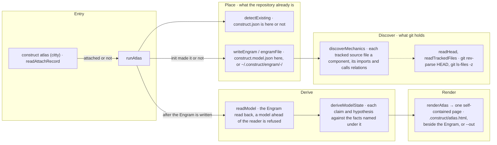

# construct atlas

The flow below is rendered from [composition/atlas.yaml](composition/atlas.yaml). Edit the model,
then run `pnpm composition:render`; `pnpm composition:check` fails when the diagram and the model
drift apart.

<!-- composition:atlas -->
`runAtlas(options)` in `src/atlas/index.ts` is the composition root: the command in `src/program.ts` reads whether `attach` recorded this repository, `detectExisting` says whether `init` made it, and the two decide where everything lands. `writeEngram` runs discovery — `git rev-parse HEAD`, `git ls-files -z` and each tracked TypeScript or JavaScript file — and writes the Engram's `mechanics` into `construct.model.json` of a repository `init` made, or into `~/.construct/engram/<repo>-<hash>/` of any other. The Engram is read back through `readModel`, the state of every claim and hypothesis is derived once with `deriveModelState`, and `renderAtlas` writes one self-contained page into `.construct/` where the construct owns that directory, beside the Engram where it does not, or at the path `--out` names. No tracked file of a repository the construct does not own is written. Dotted edges are wiring, solid edges are the flow.

<!-- /composition:atlas -->

## Where the Engram and the page land

What the repository already is decides it, and the command never asks. A repository `init` made keeps
its Engram in `construct.model.json`, with only `mechanics` replaced, and its page in
`.construct/atlas.html`, which the construct's `.gitignore` ignores. A repository `attach` recorded
keeps its Engram under `~/.construct/engram/<repo>-<hash>/` and its page in `.construct/`, which `attach`
excludes through `.git/info/exclude`, so `git status` there is as clean after the command as before.
Any other repository keeps both under `~/.construct/engram/<repo>-<hash>/`.

## One reading, one page

Discovery reads only what git holds, and the page is rendered from the Engram as written, read back
through `readModel`, never from what discovery returned in memory. Running the command again on the
same commit writes the same Engram and the same page, byte for byte. `construct graph` reads the same
model and prints its claims as Mermaid; it writes nothing, and the Atlas is the only page.
