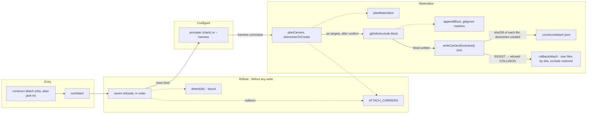

# construct attach

The flow below is rendered from [composition/attach.yaml](composition/attach.yaml). Edit the model,
then run `pnpm composition:render`; `pnpm composition:check` fails when the diagram and the model
drift apart.

<!-- composition:attach -->
`runAttach(ui, options, prompter)` in `src/commands/attach/index.ts` is the composition root: the refusals run first and every one of them exits before a byte is written; then the harness command comes from a flag or a prompt; then the carriers are planned, the exclude block, the six files and the record are written in that order. Dotted edges are wiring, solid edges are the flow.

<!-- /composition:attach -->

## Where the boundaries are

Refuse runs every check before a byte is written, in a fixed order, and each refusal leaves the tree
exactly as it found it — including `.git/info/exclude`. Configure takes the harness command from
`--harness` or asks for it; nothing is assumed, because the repository was not written by the
construct and its gate is not ours to guess. Materialize writes in one order — the exclude block, the
six carriers, the record — so a failure between two steps leaves a tree `git status` still reads as
clean and a record that names only what exists.
