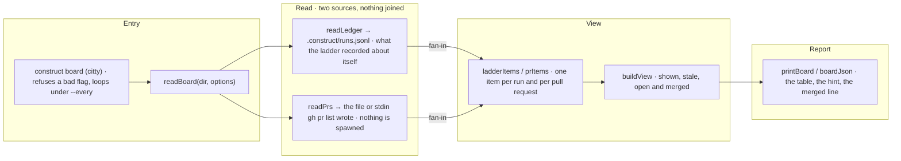

# construct board

The flow below is rendered from [composition/board.yaml](composition/board.yaml). Edit the model, then
run `pnpm composition:render`; `pnpm composition:check` fails when the diagram and the model drift
apart.

<!-- composition:board -->
`board` in `src/program.ts` is the composition root. It refuses a flag it cannot honour, then reads the two sources, each through its own reader and joined to nothing: the ladder's own record, `.construct/runs.jsonl`, through `readLedger`, and the pull request list that `gh pr list` wrote, from the file `--prs` names or from stdin. The CLI spawns no `gh`: the list is handed over, so the spawn row of the security invariants stands. `readBoard` turns what was read into items, `buildView` decides which are shown, stale, open or merged, and `printBoard` or `boardJson` renders it. With `--every` the root repeats the read and the render for each frame and clears the screen between them. Nothing is written: not the board, not a frame, not a record.

<!-- /composition:board -->

## Two sources, and nothing joined

The ladder's record and the pull request list are read separately and shown as separate rows. A ladder
run is not matched to the pull request it opened, because nothing in either record says they belong
together, and a guessed join would be a claim the board cannot stand behind.

## The pull request list is handed over

`gh` is not run by the CLI: [decision 0040](decisions/0040-the-board-reads-what-the-repository-holds.md)
leaves execution to the runner, as 0031 does for tests, and the spawn row of
[security-invariants.md](security-invariants.md) stands. A board run without `--prs` says the pull requests
were not read and prints the command that writes the file.

## Nothing is written

`--every` redraws the screen. It writes no file, into the repository or anywhere else.
