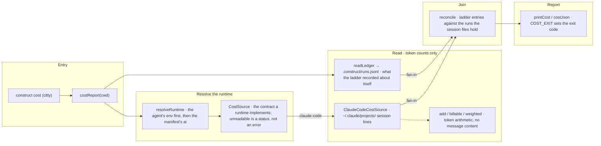

# construct cost

The flow below is rendered from [composition/cost.yaml](composition/cost.yaml). Edit the model, then
run `pnpm composition:render`; `pnpm composition:check` fails when the diagram and the model drift
apart.

<!-- composition:cost -->
`costReport(cwd)` in `src/commands/cost/index.ts` is the composition root. It resolves the runtime first — the environment variables a coding agent sets, and only failing those the `ai` the manifest recorded — then picks the `CostSource` for it. The contract has one implementation: Claude Code, which reads the session files under `~/.claude/projects/<key>` and sums token counts per workflow run through `usage.ts`; any other runtime is `unsupported`, reported rather than guessed at. In parallel the root reads the ladder's own record, `.construct/runs.jsonl`, which `/implement` appends to. Where both sides can be read, `reconcile` joins what the ladder said it did to what the session files show it spent, and the two are reported side by side rather than merged into one number. No message content is read past the token counts, and nothing is written. `COST_EXIT` maps the status to the exit code, so a run that could not be read is a non-zero exit rather than a zero total.

<!-- /composition:cost -->

## The runtime is resolved before anything is read

`resolveRuntime` asks the environment first — the variables Claude Code and Cursor set in the shell
they run a command from — and falls back to the `ai` target the manifest recorded. Only then is a
`CostSource` chosen. A runtime with no readable source returns `unsupported`, which is a status the
report carries and prints, never an empty total that would read as "nothing was spent".

## Token counts, and nothing else

`ClaudeCodeCostSource` walks the session files under `~/.claude/projects/<key>` and reads the `usage`
block of assistant messages, deduplicated by request id. No prompt, no response and no tool argument
is read past those counts, nothing is printed but the totals, and nothing is stored. That boundary is
a row in [security-invariants.md](security-invariants.md); `tests/cost.test.ts` holds it.

## Two records, reported side by side

`.construct/runs.jsonl` is what the `/implement` ladder recorded about itself: the task, the effort
class, the rungs attempted and what each one cost by its own count. The session files are what the
runtime actually billed. `reconcile` joins them by run, and the report prints both rather than
collapsing them into one figure — a ladder entry with no matching run, and a run the ladder never
claimed, are each worth seeing, and averaging them away would hide the only evidence that the ledger
is an L0 record ([0003](decisions/0003-run-ledger-stops-at-l0.md)).

## An unreadable run is not a zero

`COST_EXIT` maps `mismatch` and `unknown` to 1 and `unsupported` to 3. A directory whose session key
cannot be matched exits non-zero with the candidates it considered, so a total of zero always means
zero was spent rather than that nothing could be found.
