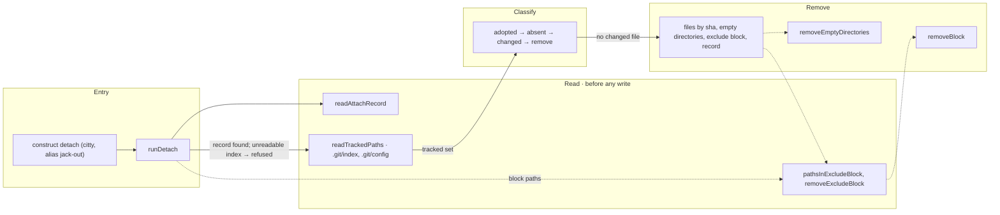

# construct detach

The flow below is rendered from [composition/detach.yaml](composition/detach.yaml). Edit the model,
then run `pnpm composition:render`; `pnpm composition:check` fails when the diagram and the model
drift apart.

<!-- composition:detach -->
`runDetach(ui, options)` in `src/commands/detach/index.ts` is the composition root: every read — the record, the exclude block, the git index, the class of each recorded file — happens before any write, and each refusal leaves the tree as it found it; then the files, their emptied directories, the exclude block and the record are removed in that order. Dotted edges are wiring, solid edges are the flow.

<!-- /composition:detach -->

## Where the boundaries are

Read happens in full before a byte is written: the record, the paths in the exclude block, the tracked
set from `.git/index`, and the class of every recorded file. Each refusal — a block without a record,
an index this reader cannot parse, a carrier whose bytes changed — returns from inside Read and leaves
the tree exactly as it found it. Classify names four classes in one fixed order, adopted first, so a
carrier git tracks is the owner's whatever its bytes. Remove takes the files, then the recorded
directories that emptied, then the block attach added to `.git/info/exclude`, then the record; a file
the record does not list is never deleted and is named in the report.
