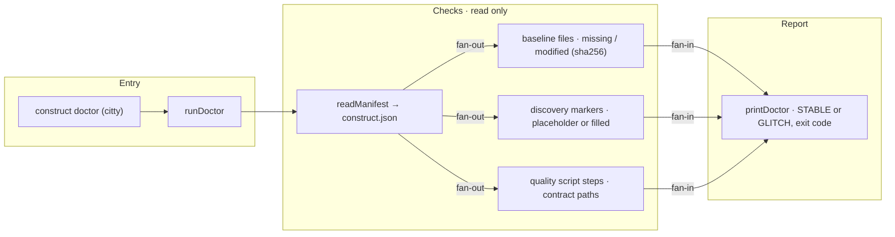

# construct doctor

The flow below is rendered from [composition/doctor.yaml](composition/doctor.yaml). Edit the model,
then run `pnpm composition:render`; `pnpm composition:check` fails when the diagram and the model
drift apart.

<!-- composition:doctor -->
`runDoctor(root)` in `src/commands/doctor.ts` is the composition root: it reads `construct.json` and derives three verdicts from it — baseline files, discovery markers, harness — then `printDoctor` turns them into `CONSTRUCT STABLE` or a named `GLITCH` list with exit code 1. Nothing is written.

<!-- /composition:doctor -->

## What decides the exit code

Only missing baseline files and harness problems make `doctor` exit 1. Modified baseline files are
expected once a project evolves and are reported as a count. Unfilled discovery markers are named as
`GLITCH` lines but do not fail the command: discovery is the agent's job, and the harness must stay
usable before it runs.
