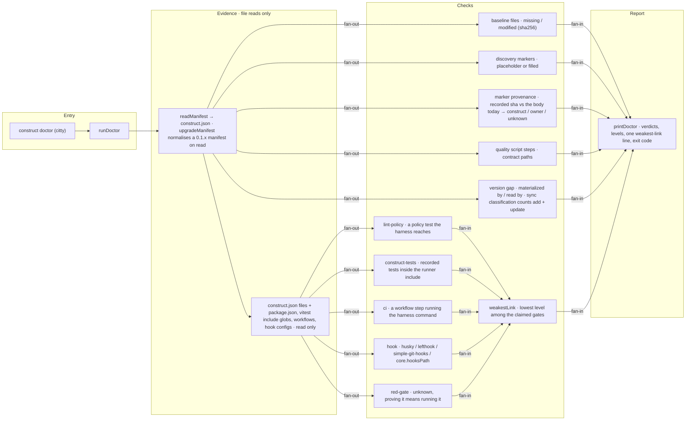

# construct doctor

The flow below is rendered from [composition/doctor.yaml](composition/doctor.yaml). Edit the model,
then run `pnpm composition:render`; `pnpm composition:check` fails when the diagram and the model
drift apart.

<!-- composition:doctor -->
`runDoctor(root)` in `src/commands/doctor/index.ts` is the composition root: it reads `construct.json` through `upgradeManifest`, gathers file evidence once, fans out to the four baseline verdicts — files, discovery markers, marker provenance, harness — and to five pure enforcement checks — plus the version gap, which replays today's templates through the sync engine's own classification and counts the paths a sync would add or update — then fans the verdicts into `printDoctor`, which ends with one weakest-link line. Provenance and the version gap are reported, never gated: neither sets an exit code, and a replay that cannot run leaves the count unestablished rather than failing the command. `doctor` executes nothing from the repository it inspects and writes nothing, including the manifest it just normalised.

<!-- /composition:doctor -->

## What decides the exit code

Only missing baseline files and harness problems make `doctor` exit 1. Modified baseline files are
expected once a project evolves and are reported as a count. Unfilled discovery markers are named as
`GLITCH` lines but do not fail the command: discovery is the agent's job, and the harness must stay
usable before it runs. Marker provenance is reported on the same terms — the markers still reading
back word for word what discovery wrote are named, and naming them changes no exit code. It is a
sixth thing doctor says, never a sixth gate.
