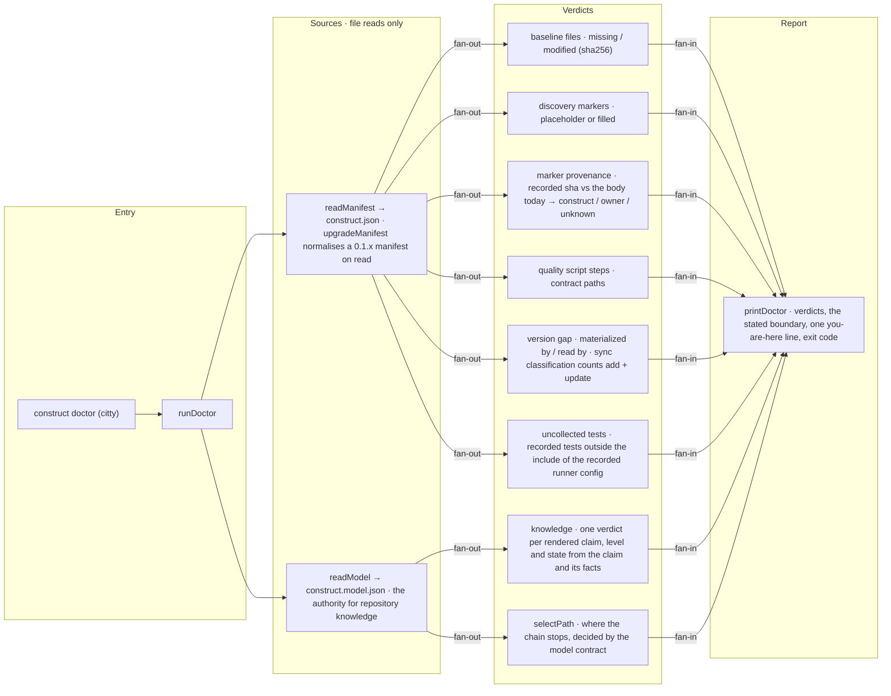

# construct doctor

The flow below is rendered from [composition/doctor.yaml](composition/doctor.yaml). Edit the model,
then run `pnpm composition:render`; `pnpm composition:check` fails when the diagram and the model
drift apart.

<!-- composition:doctor -->
`runDoctor(root)` in `src/commands/doctor/index.ts` is the composition root, and it reads two separate authorities. From `construct.json`, through `upgradeManifest`, come the provenance verdicts — baseline files, discovery markers, marker provenance, the harness script and contract paths, the recorded tests the recorded runner config does not collect, and the version gap, which replays today's templates through the sync engine's own classification and counts the paths a sync would add or update. From `construct.model.json` comes the knowledge family: every verdict renders a claim's enforcement, and where the chain stops is the model's own `selectPath`, so `doctor` derives no state of its own and holds none. A repository with no model gets no verdicts rather than an error. Both families fan into `printDoctor`, which states the boundary — nothing from the inspected repository is executed, so nothing is said about whether the harness passes — and ends with one you-are-here line. Provenance readings, the version gap and the knowledge family are reported, never gated: none sets an exit code, and a replay that cannot run leaves the count unestablished rather than failing the command. `doctor` executes nothing from the repository it inspects and writes nothing, including the manifest it just normalised.

<!-- /composition:doctor -->

## What decides the exit code

Only missing baseline files and harness problems make `doctor` exit 1. Modified baseline files are
expected once a project evolves and are reported as a count. Unfilled discovery markers are named as
`GLITCH` lines but do not fail the command: discovery is the agent's job, and the harness must stay
usable before it runs. Marker provenance is reported on the same terms — the markers still reading
back word for word what discovery wrote are named, and naming them changes no exit code. It is a
sixth thing doctor says, never a sixth gate.
