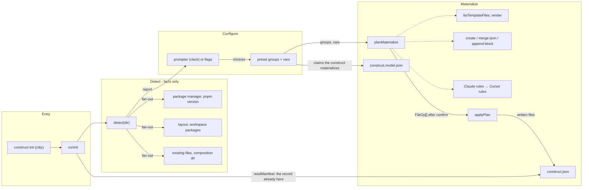

# construct init

The flow below is rendered from [composition/init.yaml](composition/init.yaml). Edit the model, then
run `pnpm composition:render`; `pnpm composition:check` fails when the diagram and the model drift
apart.

<!-- composition:init -->
`runInit(ui, options, prompter)` in `src/commands/init.ts` is the composition root: the four phases run in this order, every module is called from there, and nothing else writes to the target directory. Dotted edges are wiring, solid edges are the flow.

<!-- /composition:init -->

## Where the boundaries are

Detect returns facts and never interprets the repository — anything that needs judgement is a
discovery marker for the agent. Configure turns flags or prompts into a preset and its variables.
Materialize plans every file before writing one: the plan is what `--dry-run` prints, and the
manifest records the hashes of what was written so `doctor` can tell modified from missing.
