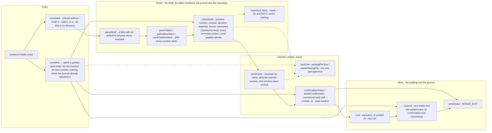

# construct intake

The flow below is rendered from [composition/intake.yaml](composition/intake.yaml). Edit the model, then
run `pnpm composition:render`; `pnpm composition:check` fails when the diagram and the model drift
apart.

<!-- composition:intake -->
`construct intake` turns a draft of sliced cards into parking cards. The slicing itself — how many cards a retelling holds, what each one touches, what the retelling left unclear — is the intake skill's, and arrives as the `--draft` JSON; the CLI runs no model and no `gh`. `runIntake` in `src/commands/intake/index.ts` is the composition root. It reads the draft and the numbers `--taken` hands over, in sequence: `parseDraft` refuses a draft that lacks a field with no default rather than inventing it, and `parseTaken` refuses anything that is not a number. The numbers are the next free after every number taken in the parking directory and in `--taken`, because card numbers are shared with pull requests and issues. `checkDraft` corrects or marks unclear, by facts, each wrong path, named number, contour, decision, merged depends/blocks and command-less witness. It reads the repository under --dir only through `facts.ts` and merged tasks from --journal through `mergedTasks` in `src/card/closed.ts`. Each correction is a `corrected:` line. `sliceCards` resolves `depends` by name inside the draft, adds the matching `blocks`, defaults only `contour` and `decision` and marks each default as an `unclear:` line, keeps every card with an unclear line at `who: window`, renders the card line and the file with the renderers that sit beside the card grammar in `src/card/`, and parses every file back with `parseParkingFile` — the one parser `task:start` and the shift read. One refused card refuses the whole draft, and nothing is written. `--dry-run` prints the cards; otherwise, when any card carries a correction and neither `--auto-confirm` nor a `--confirm` naming the hash of exactly these cards was given, `confirm.ts` holds them: nothing is written, the corrections and the token are printed, and the exit is 2. A confirmed or correction-free draft is written card by card, once, exclusively, into the parking directory, which is outside the repository, so an attached repository gets no file; then each card gets an `intake` line in --journal naming its confirmation (`person`, `auto` or `none`) and its corrections. `--admit <parking>/<id>.md` routes to `runAdmit` in `src/commands/intake/admit.ts` instead, for a card parked before the intake door: it parses the file with `parseParkingFile`, runs the same `checkDraft` under the card's own number, holds a corrected card behind the same confirmation token, rewrites only the card line, the touches line and the appended `corrected:` and `unclear:` lines, and writes one `intake` line with `source: admit`; a card whose line the journal already admitted is left alone.

<!-- /composition:intake -->

## The skill slices, the CLI numbers and checks

The intake skill reads a person's retelling and decides what it means: how many cards, what each one
touches, what was left unclear. `construct intake` does what a model must not guess: the numbers, the
format and the check. Its output is the parking format `task:start` and the shift already read, and
every file is parsed back with that same parser before it is written.

## Unclear is written down, not guessed

Only `contour` and `decision` have a default, and each default is written into the card as an
`unclear:` line. A field with no safe default is refused. A card that carries an `unclear:` line is
parked with `who: window`, so the unattended shift does not take it until a person has settled it.

## Corrected is written down, not applied silently

A `touches` path that does not exist, a number the retelling names, a contour or decision outside the
card grammar and a `depends` on a card already closed are each corrected by facts, and each correction
is written into the card as `corrected: <field> — <was> → <now> — <reason>`, so the original is never
lost. Where the facts do not name one answer, the value stays as written and an `unclear:` line says
what was found. A change of some kinds always carries companions — a README row, a `docs/guide` page,
a CONTRIBUTING row, a changeset, the test beside the code — and asking for each of them stops an
unattended shift on a question whose answer is mechanical. One table, `COMPANION_TABLE` in
`src/commands/intake/check.ts`, maps a kind of touched path to its companions; intake adds every
companion a card lacks to `touches` as a correction, and those corrections alone do not hold the card
for a person. The check refuses nothing: a kind outside the grammar is still refused by the
grammar's own reason.

## Corrected is confirmed before it is parked

A correction changes what the person asked for, so a draft with any correction is held: nothing is
parked, the corrections are printed with a token, and the person confirms them by running the same
command with `--confirm <token>`. The token is the hash of the cards as printed, so a confirmation
covers exactly the list the person saw. `--auto-confirm`, off by default, is the person accepting
corrections in advance; those cards are parked at once. Every parked card leaves an `intake` line in
the journal with its confirmation (`person`, `auto` or `none`) and its corrections, so the corrections
an auto-confirmed run accepted are not lost and the flag's use is on record. A confirmed card keeps the
`who` of its draft; only an `unclear:` line or the split signal still holds it at `who: window`.

## Too big to take whole is seen before the work, not after two falls

The two-falls rule cuts a task after it failed twice; the split signal reads a card before it is
parked. `splitSignal` in `src/card/complexity.ts` counts four signals from the card alone: more
`touches` or areas than a ladder run holds, a path of the mechanism the task itself runs on, a
generated file next to one of its sources, and more `unclear:` lines than a brief can settle. One
signal is common and splits nothing; two or more write a `seam: complexity` line naming every signal
that fired and the principle — slice by complexity first, by the risk matrix R1–R4 when those slices
do not hold — plus a `slice:` line per proposed sub-card, grouped by area with generated files last,
and hold the card at `who: window`. The signal proposes and never reclassifies: kind, contour and
decision stay as the draft states them, and the person slices the card or keeps it whole with the
reason written. Complexity and risk are two axes; the signal reads complexity only. The MORSE forecast
is not one of the signals yet: intake has no reader of it.

## Risk is the second axis, and its seam is offered only where complexity found none

`riskReading` in `src/card/risk.ts` reads the same `touches` for risk, and every sliced card gets one
`risk: R<n> — <meaning> — <why>` line in its body, naming each touch at the level that decides. The
levels follow the owner's Forge principle, in this repository's own words:

- `R1` — critical: a person decides it and a review reads it before it merges
- `R2` — high: a contract or a recorded shape that others read changes; a review reads it
- `R3` — moderate: a capability grows beside what already works; the harness and a review
- `R4` — low: tests close it

The highest level any touch reaches decides, and a glob reaches every path under it. R1 by path is the
core: the ladder mechanism a task runs on (the implement skill, the agents, `scripts/construct`,
`implement.workflow`, `check-acceptance`, and their template twins), what `init`, `attach`, `sync` or
`detach` write into another repository (`templates/**` with the attach carriers, `src/materialize`,
`src/sync`, `src/manifest.ts`, `src/presets`, those commands, `scripts/attach`), and
`architecture/security-invariants.md`. R2 is a contract or a recorded shape others read
(`contract/`, `src/detect`, `src/model/schema.ts`). R4 is documentation, a log, a test, a changeset or
a script outside the gate. Everything else is R3. The level is a reading of paths, not of meaning, and
is revised as the work shows what it really touches; the card line gets no field for it.

When a card holds R1 together with R3–R4 work and the complexity seam proposed no slices, intake
offers the risk seam: a `seam: risk — … — <principle>` line and two `slice: <n> R<k> — <touches>`
lines, the R1 side and the rest, each with the highest level inside it, and the card is held at
`who: window`. Tests and the changeset go with the lower side and never make a card mixed on their
own. A slice never parts what must change together: a generated file stays with its sources
(`contract/surface.json`, `templates/attach/earlier-carriers.json`) and a template with its twin
(`.claude/**` and `templates/ai/*/_claude/**`, `scripts/construct/**` and its template copy), so a
coupled group lands on the R1 side when any member is R1. When the R1 side is only carrier delivery
(`templates/ai`, `templates/attach`, `src/presets`, `scripts/attach`, and their twins) and the rest
carries code, the seam is named `capability / delivery` and the slices `delivery` and `capability`.
The seam only proposes: kind, contour and decision stay as the draft states them, and a person slices
the card or keeps it whole with the reason written.

## A card parked before the door is admitted, not re-sliced

`task:start` and the shift take only a card with an `intake` line, and a card parked before that door
has none. `construct intake --admit <parking>/<id>.md` gives it one without slicing it again: the card
keeps its number and its file, the same facts check runs under that number, and a correction is held
behind the same token until a person confirms it. Only the card line and the `touches` line change,
and only by a correction; the `corrected:` and `unclear:` lines are appended, and `who` stays as the
card states it. The `intake` line carries `source: admit`. A second `--admit` of a card the journal
already admitted writes nothing.
