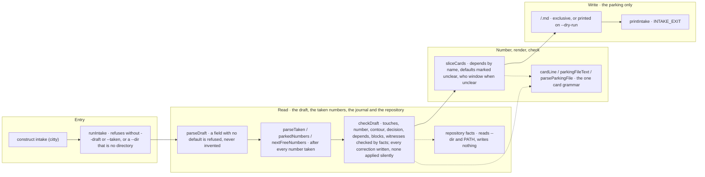

# construct intake

The flow below is rendered from [composition/intake.yaml](composition/intake.yaml). Edit the model, then
run `pnpm composition:render`; `pnpm composition:check` fails when the diagram and the model drift
apart.

<!-- composition:intake -->
`construct intake` turns a draft of sliced cards into parking cards. The slicing itself — how many cards a retelling holds, what each one touches, what the retelling left unclear — is the intake skill's, and arrives as the `--draft` JSON; the CLI runs no model and no `gh`. `runIntake` in `src/commands/intake/index.ts` is the composition root. It reads the draft and the numbers `--taken` hands over, in sequence: `parseDraft` refuses a draft that lacks a field with no default rather than inventing it, and `parseTaken` refuses anything that is not a number. The numbers are the next free after every number taken in the parking directory and in `--taken`, because card numbers are shared with pull requests and issues. `checkDraft` corrects or marks unclear, by facts, each wrong path, named number, contour, decision, closed depends/blocks and command-less witness. It reads the repository under --dir only through `facts.ts` and closed tasks from --journal through `closedTasks` in `src/card/closed.ts`. Each correction is a `corrected:` line, and any corrected card stays at `who: window`. `sliceCards` resolves `depends` by name inside the draft, adds the matching `blocks`, defaults only `contour` and `decision` and marks each default as an `unclear:` line, keeps every card with an unclear line at `who: window`, renders the card line and the file with the renderers that sit beside the card grammar in `src/card/`, and parses every file back with `parseParkingFile` — the one parser `task:start` and the shift read. One refused card refuses the whole draft, and nothing is written. `--dry-run` prints the cards; otherwise each is written once, exclusively, into the parking directory, which is outside the repository, so an attached repository gets no file.

<!-- /composition:intake -->

## The skill slices, the CLI numbers and checks

The intake skill reads a person's retelling and decides what it means: how many cards, what each one
touches, what was left unclear. `construct intake` does what a model must not guess: the numbers, the
format and the check. Its output is the parking format `task:start` and the shift already read, and
every file is parsed back with that same parser before it is written.

## Unclear is written down, not guessed

Only `contour` and `decision` have a default, and each default is written into the card as an
`unclear:` line. A field with no safe default is refused. A card that carries an `unclear:` line is
parked with `who: window`, so the unattended shift does not take it until a person has settled it.

## Corrected is written down, not applied silently

A `touches` path that does not exist, a number the retelling names, a contour or decision outside the
card grammar and a `depends` on a card already closed are each corrected by facts, and each correction
is written into the card as `corrected: <field> — <was> → <now> — <reason>`, so the original is never
lost. Where the facts do not name one answer, the value stays as written and an `unclear:` line says
what was found. A card with any correction stays at `who: window` until a person confirms it. The
check refuses nothing: a kind outside the grammar is still refused by the grammar's own reason.
