# The repository knowledge model

`construct.model.json` is what this tool holds to be true about a repository, and on what grounds.
It carries facts, claims made by the construct, hypotheses written by discovery, and the way each
one is enforced and verified.

It is a separate authority from `construct.json`, not a second view of it:
[decision 0016](decisions/0016-the-model-is-the-source.md) draws the line — `construct.json` is the
authority for file provenance, the model is the authority for repository knowledge, and neither may
become a second source for what the other owns. `doctor`, the graph and every report are
projections of the model and hold no state of their own.

The vocabulary below lives in `src/model/`. This document is its second reader:
`tests/model-vocabulary.test.ts` reads the enums from the source and fails when a member is not
explained here.

## Facts — what can be pointed at

A fact is something deterministic code can look at without judgement
([decision 0015](decisions/0015-interpretation-stays-with-the-agent.md)). There are two kinds.

| Kind | What it asserts |
|---|---|
| `file-exists` | The file at `path` is present in the repository. |
| `file-contains` | The file at `path` is present and contains the literal `needle`. |

Everything else in the model — a claim, a hypothesis, an enforcement — stands on facts by naming
their ids in `supportedBy`. Nothing stands on prose.

## Authorship — who wrote an entry, and what `init` may rewrite

Every fact, claim and hypothesis carries an `authoredBy`, from one list shared by all three.

| Author | Meaning |
|---|---|
| `construct` | `init` wrote the entry from the preset, and `init` owns it. |
| `discovery` | The discovery protocol wrote the entry from what it found in the repository. |
| `unknown` | The entry was not written by the construct and its author was not recorded. |

`authoredBy` is the sole source of ownership for model entries. `init` may replace only entries
authored by `construct`; entries with any other author are carried over unchanged. No other way of
deriving ownership is permitted — not from what references an entry, not from whether the preset
still produces it, not from where it sits in the file. A second derivation would give one question
two answers, and [decision 0016](decisions/0016-the-model-is-the-source.md) exists so that the model
gives one. Nothing checks this rule mechanically: it is held by review, and it is written here so
that the next consumer reads it rather than inventing its own answer.

`init` is additive, exactly as it is for the manifest
([decision 0013](decisions/0013-a-second-init-adds-to-the-record.md)). A second run rewrites only the
entries whose author is `construct`: one the preset still makes is replaced with the freshly built
version in the place it already held, one the preset no longer makes is dropped, and everything
authored by anyone else is carried over untouched. Entries that survive keep their relative order,
because declaration order in `claims` breaks ties; only genuinely new entries are appended. A
construct-authored fact another surviving entry still stands on is kept, so the merged model always
parses.

The consequence is worth stating plainly: **a hand-edited entry still authored by `construct` is
overwritten by the next `init`.** Change its `authoredBy` to `discovery` or `unknown` and the edit
survives. There is no force flag and no backup file; ownership is the only thing that decides.

### When a construct-authored fact stops matching

A fact the construct wrote can stop matching for more than one reason. The path it names may move —
a workflow renamed. Or the shape of what its needle looks for may change — a script rewritten into an
equivalent form, a command lifted into a script of its own. The derived state is `unsupported` either
way, and it means **this fact no longer matches**, not *the enforcement is gone*. Those are different
sentences, and only the first one is being asserted.

The supported way out is the same in every such case, and does not vary with the reason: change the
fact's `authoredBy` away from `construct` and edit it to match, accepting that `init` stops
maintaining that fact and that later corrections shipped with a preset will not reach it. Editing the
fact while leaving it authored by `construct` is not a fix — the next `init` overwrites it, which is
the ownership rule above working exactly as written. Putting the file or the wording back the way the
construct expects is the alternative, and it is the better one only where the change was accidental.

## Fact evaluations — the answer for one fact, now

A fact is evaluated on every read; the answer is never stored.

| Evaluation | Meaning |
|---|---|
| `holds` | The file was read and the assertion is true of it. |
| `does-not-hold` | The file was read, or shown to be absent, and the assertion is false of it. |
| `unevaluable` | The fact could not be evaluated at all — the read failed. |

`unevaluable` exists because a failed read is not a finding. [Rule 2](epistemic-rules.md) keeps
`unknown` and `absent` apart: absence is asserted only with full scope evidence, and not having
looked is not evidence of anything.

## Model states — what a chain of facts yields

A claim's enforcement, a claim's verification and a hypothesis each resolve to one state, derived
from the facts named under them. The state is never written into the file.

| State | Meaning |
|---|---|
| `held` | Facts are named, every one was evaluated, and every one holds. |
| `unsupported` | Facts are named, every one was evaluated, and at least one does not hold. |
| `unknown` | No fact is named, or a named fact was `unevaluable`. |

### Why `unsupported` and `unknown` differ

`unsupported` asserts a negative — *this is not true here* — and that is only honest when every
named fact was actually looked at. One fact that could not be read turns the whole chain `unknown`,
never `unsupported`. A chain with no facts under it is `unknown` too: nobody looked, so there is
nothing to report.

### Why there is no state and no confidence in the file

State is derived on every read because a stored state is a claim about a repository that has
changed since. And no `confidence` number is recorded, under any name:
[rule 7](epistemic-rules.md) says confidence does not replace an evidence state, and a number beside
a hypothesis invites exactly that substitution — a reader takes 0.9 for *known* and 0.4 for
*unknown*, when both are silent about whether anything was checked.

## Enforcement levels — how strongly a claim is held up

| Level | Meaning |
|---|---|
| `L0` | Text only: the claim is written down and nothing checks it. |
| `L1` | Review: a human applies it. |
| `L2` | A local hook runs the check. |
| `L3` | CI runs the check and reports. |
| `L4` | CI runs the check and blocks the merge. |

Every level above L0 presumes a mechanism that **can report a failure**. L3 and L4 differ over
whether a failure blocks a merge; L0 and L3 differ over whether a failure can be raised at all. A
check that is green whether or not the invariant holds reports nothing and is L0, however much
machinery stands behind it.

An enforcement is never a bare level. It carries a `mechanism` and the `supportedBy` facts that hold
that level up, because [rule 8](epistemic-rules.md) separates the presence of a command from the
level at which it is enforced: a script in `package.json` with no hook and no CI is L0, not L2. A
level whose facts stop holding therefore becomes `unsupported` rather than staying a number nobody
can check. [Rule 1](epistemic-rules.md) is the same separation one step earlier — the claim, the
thing that checks it, and how strongly it is checked are three facts, not one column.

## Claims are about mechanisms, not goals

A claim carries exactly one `enforcement`, and that is deliberate. [Rule 1](epistemic-rules.md)
separates three facts — that something is required, that something checks it, and how strongly it is
checked — and the schema keeps them apart by giving one claim one checker at one level. "Every change
passes the harness through CI" and "every change passes the harness through a local hook" therefore
say the same *goal* but name two different mechanisms, so they are two claims, not one claim with two
enforcers.

Read as goals they look like duplicates, and merging them looks like tidying. Read as mechanisms they
are not: CI holds at L3 and a hook at L2, they stand on different files, and either can stop holding
while the other still does. A single claim with two enforcers would have to answer "is this held?"
with one state for two independent mechanisms — which is exactly the one-column table rule 1 exists to
prevent. Keeping them apart is what lets `doctor` say *which* mechanism stopped holding, and lets a
repository that has one and not the other be described honestly rather than half-credited.

## Hypotheses — what discovery concluded, and the tree it was read from

A hypothesis is an interpretation: what discovery concluded about a repository from the facts it
names. Every property below is required, and `tests/model-vocabulary.test.ts` reads the property
list from `src/model/schema.ts` and fails when one of them is not explained here.

| Property | Meaning |
|---|---|
| `id` | The name other entries and reports use for this hypothesis. |
| `statement` | The interpretation itself, in one sentence. |
| `authoredBy` | Who wrote the entry, from the authors above. |
| `baseSha` | The commit that was checked out when the run that formed this hypothesis began reading, before that run had written anything; `null` where there was no commit to name. |
| `evidenceClean` | Whether the files named by the facts under `supportedBy` — and those files only, not the tree around them — carried no uncommitted change when the run read them. |
| `supportedBy` | The ids of the facts the interpretation stands on. |

### `evidenceClean` is about the evidence read, never the tree around it

`evidenceClean` describes what the hypothesis was **derived from**: the files its own facts point at,
as they stood before the run began writing. It says nothing whatever about the rest of the tree, about
the tree at the moment the entry was written, or about the repository at any later time. A dirty
README does not undermine a conclusion about `apps/`; an uncommitted `apps/api/src/app.ts` under a
conclusion that stands on it does, and that is the whole difference the scope buys.

Read as the cleanliness of the whole tree instead, the field is constant wherever it matters most.
A discovery run dirties the tree itself — filling a marker is a write — and on a repository the
construct adopts, `init` has just written dozens of files into it before discovery reads anything, so
every entry would carry `false`: mandatory, and carrying no information at all. Scoped to the
evidence, both values are reachable on that same path — a hypothesis standing on the repository's own
committed files reads `true`, one standing on a file `init` just wrote reads `false`.

`baseSha` and `evidenceClean` constrain each other in no way, and they are not two halves of one
reading: `baseSha` names the commit the run started from, `evidenceClean` speaks only of the files the
facts name. All four combinations occur and all four are legitimate: a repository with files and no
commit at all is `baseSha: null` with `evidenceClean: false`.

### `evidenceClean` is a claim, not a measurement

Nothing in this tool verifies `evidenceClean`. Discovery computes it during its own run — the
protocol carries the `git status --porcelain` one-liner that produces it — and by the time anyone
reads the model the tree has moved on, so there is no later moment at which the value could be
confirmed or refuted. It has exactly the nature of `authoredBy`: recorded by the writer, taken on the
writer's word, never re-derived on read. A reader looking for the check that confirms it should stop
looking — there is none, and its absence is not an omission.

### Hypotheses with different bases belong together

After a second discovery run the model holds hypotheses carrying different `baseSha` values, and that
is the design rather than a defect to tidy away. [Rule 5](epistemic-rules.md) requires every finding
to record the base it was made against precisely so that a fresh interpretation can be told from a
stale one: the base is what distinguishes them. Do not align the bases, and do not read the
divergence as an inconsistency in the file.

## Where a verdict belongs — knowledge or provenance

A verdict is **knowledge** if it can become false without anything `init` wrote changing. It is
**provenance** if it becomes false only when what `init` installed has changed — and provenance is
`construct.json`'s question, not the model's
([decision 0016](decisions/0016-the-model-is-the-source.md)).

`harness-steps` is knowledge. It asks whether the harness command really runs every step the preset
wrote into it — `composition:check`, lint, typecheck and tests; the `package.json` it reads belongs
to the repository's owner, who can rewrite the script
tomorrow without touching a construct file. The claim can go from held to unsupported with the
construct untouched, which is what makes it worth holding. Where the preset materializes an HTTP
contract, the `contracts:check` step of that same command stands under the same claim, for the same
reason. What stays provenance is the record around the command: that `package.json` is there, that
it carries the script `construct.json` named, and that the contract paths that manifest records
resolve.

`construct-tests` is provenance. It asks whether the test files `construct.json` recorded are still
collected by the runner config `init` also wrote: both ends were installed by the construct, so the
answer changes only when the construct's own files changed. That reasoning holds only while the
construct owns both ends. Where a repository arrived with its own runner config, the construct never
wrote that end, and a verdict there would pronounce on a file its owner owns — so the check must stay
silent instead. That makes `construct-tests` conditional in the same way `lint-policy` is: the same
rule, a different condition. `lint-policy` exists only where the preset's sample was materialized,
because only then did the construct write the policy test it stands on.

## Chain stages — where a claim stops being held

A claim is read as a chain, in this order.

| Stage | Meaning |
|---|---|
| `enforcement` | Something requires the claim, at a named level, on named facts. |
| `verification` | Something demonstrates the claim actually holds, on named facts. |

The chain stops at the first stage that is not `held`, and that point is what `doctor` reports as
where you are. A claim stopping at `enforcement` is further from done than one stopping at
`verification`, so the shallower stop is selected first. When two claims stop at the same stage,
declaration order in the model breaks the tie: the first claim declared wins. Path selection and
tie-breaking are part of the model contract, so the same model always yields the same answer
([decision 0016](decisions/0016-the-model-is-the-source.md)).

## What the model deliberately does not add

None of this is a new way of knowing. Every state above is derived from a file read or a literal
match that the tool could already do; the model only holds them in one object
([decision 0017](decisions/0017-v5-adds-no-new-way-of-knowing.md)). Recognition of an unfamiliar
stack improves by improving the discovery protocol, which writes better hypotheses, not by adding
detectors to the CLI.

## The picture — the same model, drawn

The block below is rendered from this repository's own `construct.model.json` by
`pnpm model:render`, and `pnpm run quality` runs `pnpm model:check`, which reports the block as stale
until it is rendered again. It is a third projection of the model beside `doctor` and the reports
([decision 0016](decisions/0016-the-model-is-the-source.md)) and holds nothing of its own: every
state in it comes from `deriveModelState`, and a repository with no model renders a sentence saying
so rather than an empty diagram.

<!-- model:picture -->
What this tool holds about the repository, and the files each reading stands on. A fact several entries stand on is drawn once, with one edge from each of them. Every state below is derived on read, never stored.

```mermaid
flowchart LR
  subgraph claims["Claims"]
    e_no_committed_secret["no-committed-secret<br/>enforcement L3 held<br/>verification held"]
    e_vulnerable_dependencies_are_visible["vulnerable-dependencies-are-visible<br/>enforcement L0 held<br/>verification held"]
    e_every_change_passes_the_harness["every-change-passes-the-harness<br/>enforcement L3 held<br/>verification held"]
    e_harness_steps["harness-steps<br/>enforcement L3 held<br/>verification held"]
  end
  subgraph hypotheses["Hypotheses"]
    e_the_command_list_is_stated_in_three_documents("the-command-list-is-stated-in-three-documents<br/>held")
    e_the_dependency_audit_job_cannot_fail("the-dependency-audit-job-cannot-fail<br/>held")
    e_the_upgrade_guide_names_init_as_what_writes_a_model("the-upgrade-guide-names-init-as-what-writes-a-model<br/>held")
    e_occurrences_live_in_observations_not_in_the_records_they_bear_on("occurrences-live-in-observations-not-in-the-records-they-bear-on<br/>held")
    e_every_stack_with_a_lint_policy_ships_its_own_policy_test("every-stack-with-a-lint-policy-ships-its-own-policy-test<br/>held")
    e_user_facing_text_has_one_owner_and_a_plain_counterpart("user-facing-text-has-one-owner-and-a-plain-counterpart<br/>held")
    e_the_tool_is_its_own_first_consumer("the-tool-is-its-own-first-consumer<br/>held")
    e_each_composed_flow_is_modelled_and_its_render_is_gated("each-composed-flow-is-modelled-and-its-render-is-gated<br/>held")
    e_the_spawn_exemption_lifts_the_whole_syntax_block("the-spawn-exemption-lifts-the-whole-syntax-block<br/>unsupported")
    e_reading_an_inspected_repository_is_concentrated_by_lint("reading-an-inspected-repository-is-concentrated-by-lint<br/>held")
    e_each_record_declares_its_own_version_and_shares_one_refusal("each-record-declares-its-own-version-and-shares-one-refusal<br/>held")
    e_what_the_package_would_publish_is_scanned_by_the_harness("what-the-package-would-publish-is-scanned-by-the-harness<br/>held")
    e_the_harness_gates_generated_artifacts_against_their_sources("the-harness-gates-generated-artifacts-against-their-sources<br/>held")
  end
  subgraph evidence["Evidence"]
    f_security_workflow[/".github/workflows/security.yml<br/>holds"/]
    f_security_workflow_runs_gitleaks[/".github/workflows/security.yml contains #quot;gitleaks#quot;<br/>holds"/]
    f_gitleaks_config[/".gitleaks.toml<br/>holds"/]
    f_security_workflow_audits_dependencies[/".github/workflows/security.yml contains #quot;pnpm audit --audit-level=high#quot;<br/>holds"/]
    f_ci_workflow[/".github/workflows/ci.yml<br/>holds"/]
    f_ci_workflow_runs_the_harness[/".github/workflows/ci.yml contains #quot;pnpm run quality#quot;<br/>holds"/]
    f_eslint_config[/"eslint.config.mjs<br/>holds"/]
    f_security_invariants[/"architecture/security-invariants.md<br/>holds"/]
    f_harness_manifest[/"package.json<br/>holds"/]
    f_harness_script_runs_composition_check[/"package.json contains #quot;pnpm composition:check#quot;<br/>holds"/]
    f_harness_script_runs_lint[/"package.json contains #quot;pnpm lint#quot;<br/>holds"/]
    f_harness_script_runs_typecheck[/"package.json contains #quot;pnpm typecheck#quot;<br/>holds"/]
    f_harness_script_runs_tests[/"package.json contains #quot;pnpm test#quot;<br/>holds"/]
    f_readme_states_the_harness_command[/"README.md contains #quot;pnpm run quality#quot;<br/>holds"/]
    f_claude_md_states_the_harness_command[/"CLAUDE.md contains #quot;pnpm run quality#quot;<br/>holds"/]
    f_agents_md_states_the_harness_command[/"AGENTS.md contains #quot;pnpm run quality#quot;<br/>holds"/]
    f_dependency_audit_continues_on_error[/".github/workflows/security.yml contains #quot;continue-on-error: true#quot;<br/>holds"/]
    f_upgrade_guide_names_init[/"docs/guide/upgrading.md contains #quot;npx mikoshi-construct@latest init#quot;<br/>holds"/]
    f_observations_records_an_occurrence[/"architecture/observations.md contains #quot;testsWeakened#quot;<br/>holds"/]
    f_decisions_index_sends_occurrences_elsewhere[/"architecture/decisions/README.md contains #quot;Occurrences of something a record already describes belong in#quot;<br/>holds"/]
    f_backend_sample_policy_test[/"templates/presets/node-backend/sample/scripts/tests/lint/syntax-policy.test.ts<br/>holds"/]
    f_frontend_sample_policy_test[/"templates/presets/node-frontend/sample/scripts/tests/lint/syntax-policy.test.ts<br/>holds"/]
    f_monorepo_sample_policy_test[/"templates/presets/monorepo/sample/scripts/tests/lint/syntax-policy.test.ts.eta<br/>holds"/]
    f_frontend_policy_test_asserts_per_role[/"templates/presets/node-frontend/sample/scripts/tests/lint/syntax-policy.test.ts contains #quot;ROLES#quot;<br/>holds"/]
    f_one_vocabulary_module[/"src/ui/lore.ts<br/>holds"/]
    f_vocabulary_carries_a_plain_counterpart[/"src/ui/lore.ts contains #quot;PLAIN_LORE#quot;<br/>holds"/]
    f_carries_its_own_manifest[/"construct.json<br/>holds"/]
    f_carries_its_own_model[/"construct.model.json<br/>holds"/]
    f_init_flow_model[/"architecture/composition/init.yaml<br/>holds"/]
    f_doctor_flow_model[/"architecture/composition/doctor.yaml<br/>holds"/]
    f_sync_flow_model[/"architecture/composition/sync.yaml<br/>holds"/]
    f_graph_flow_model[/"architecture/composition/graph.yaml<br/>holds"/]
    f_cost_flow_model[/"architecture/composition/cost.yaml<br/>holds"/]
    f_the_spawn_block_ignores_one_whole_file[/"eslint.config.mjs contains #quot;ignores: ['src/detect/package-manager.ts']#quot;<br/>does not hold"/]
    f_the_spawn_block_also_carries_the_loading_ban[/"eslint.config.mjs contains #quot;...NO_CHILD_PROCESS, ...NO_RUNTIME_CODE_LOADING, ...NO_BARE_INIT_RECORD]#quot;<br/>holds"/]
    f_one_reader_for_an_inspected_repository[/"src/commands/doctor/readings.ts<br/>holds"/]
    f_lint_names_the_one_reader[/"eslint.config.mjs contains #quot;doctorReadsThroughOneReader#quot;<br/>holds"/]
    f_the_one_reader_rule_states_its_reason[/"eslint.config.mjs contains #quot;READS_GO_THROUGH_ONE_READER#quot;<br/>holds"/]
    f_the_manifest_declares_its_schema_version[/"construct.json contains #quot;manifestVersion#quot;<br/>holds"/]
    f_the_model_schema_declares_its_version[/"src/model/schema.ts contains #quot;modelVersion#quot;<br/>holds"/]
    f_one_shared_refusal_for_both_records[/"src/record-ahead.ts<br/>holds"/]
    f_privacy_guard[/"scripts/privacy/check.ts<br/>holds"/]
    f_privacy_guard_names_what_it_scans[/"scripts/privacy/scan.ts contains #quot;SCANNED_PATHS = ['templates', 'docs', 'README.md', 'tests/fixtures']#quot;<br/>holds"/]
    f_harness_script_runs_privacy_check[/"package.json contains #quot;pnpm privacy:check#quot;<br/>holds"/]
    f_harness_script_runs_model_check[/"package.json contains #quot;pnpm model:check#quot;<br/>holds"/]
    f_harness_script_runs_docs_anchors[/"package.json contains #quot;pnpm docs:anchors#quot;<br/>holds"/]
  end
  e_no_committed_secret -->|"enforcement"| f_security_workflow
  e_no_committed_secret -->|"enforcement"| f_security_workflow_runs_gitleaks
  e_no_committed_secret -->|"verification"| f_gitleaks_config
  e_vulnerable_dependencies_are_visible -->|"enforcement"| f_security_workflow
  e_vulnerable_dependencies_are_visible -->|"enforcement"| f_security_workflow_audits_dependencies
  e_vulnerable_dependencies_are_visible -->|"verification"| f_security_invariants
  e_every_change_passes_the_harness -->|"enforcement"| f_ci_workflow
  e_every_change_passes_the_harness -->|"enforcement"| f_ci_workflow_runs_the_harness
  e_every_change_passes_the_harness -->|"verification"| f_eslint_config
  e_harness_steps -->|"enforcement"| f_ci_workflow_runs_the_harness
  e_harness_steps -->|"enforcement"| f_harness_script_runs_composition_check
  e_harness_steps -->|"enforcement"| f_harness_script_runs_lint
  e_harness_steps -->|"enforcement"| f_harness_script_runs_typecheck
  e_harness_steps -->|"enforcement"| f_harness_script_runs_tests
  e_harness_steps -->|"verification"| f_harness_manifest
  e_the_command_list_is_stated_in_three_documents --> f_readme_states_the_harness_command
  e_the_command_list_is_stated_in_three_documents --> f_claude_md_states_the_harness_command
  e_the_command_list_is_stated_in_three_documents --> f_agents_md_states_the_harness_command
  e_the_dependency_audit_job_cannot_fail --> f_dependency_audit_continues_on_error
  e_the_upgrade_guide_names_init_as_what_writes_a_model --> f_upgrade_guide_names_init
  e_occurrences_live_in_observations_not_in_the_records_they_bear_on --> f_observations_records_an_occurrence
  e_occurrences_live_in_observations_not_in_the_records_they_bear_on --> f_decisions_index_sends_occurrences_elsewhere
  e_every_stack_with_a_lint_policy_ships_its_own_policy_test --> f_backend_sample_policy_test
  e_every_stack_with_a_lint_policy_ships_its_own_policy_test --> f_frontend_sample_policy_test
  e_every_stack_with_a_lint_policy_ships_its_own_policy_test --> f_monorepo_sample_policy_test
  e_every_stack_with_a_lint_policy_ships_its_own_policy_test --> f_frontend_policy_test_asserts_per_role
  e_user_facing_text_has_one_owner_and_a_plain_counterpart --> f_one_vocabulary_module
  e_user_facing_text_has_one_owner_and_a_plain_counterpart --> f_vocabulary_carries_a_plain_counterpart
  e_the_tool_is_its_own_first_consumer --> f_carries_its_own_manifest
  e_the_tool_is_its_own_first_consumer --> f_carries_its_own_model
  e_each_composed_flow_is_modelled_and_its_render_is_gated --> f_init_flow_model
  e_each_composed_flow_is_modelled_and_its_render_is_gated --> f_doctor_flow_model
  e_each_composed_flow_is_modelled_and_its_render_is_gated --> f_sync_flow_model
  e_each_composed_flow_is_modelled_and_its_render_is_gated --> f_graph_flow_model
  e_each_composed_flow_is_modelled_and_its_render_is_gated --> f_cost_flow_model
  e_each_composed_flow_is_modelled_and_its_render_is_gated --> f_harness_script_runs_composition_check
  e_the_spawn_exemption_lifts_the_whole_syntax_block --> f_the_spawn_block_ignores_one_whole_file
  e_the_spawn_exemption_lifts_the_whole_syntax_block --> f_the_spawn_block_also_carries_the_loading_ban
  e_the_spawn_exemption_lifts_the_whole_syntax_block --> f_eslint_config
  e_reading_an_inspected_repository_is_concentrated_by_lint --> f_one_reader_for_an_inspected_repository
  e_reading_an_inspected_repository_is_concentrated_by_lint --> f_lint_names_the_one_reader
  e_reading_an_inspected_repository_is_concentrated_by_lint --> f_the_one_reader_rule_states_its_reason
  e_reading_an_inspected_repository_is_concentrated_by_lint --> f_eslint_config
  e_each_record_declares_its_own_version_and_shares_one_refusal --> f_the_manifest_declares_its_schema_version
  e_each_record_declares_its_own_version_and_shares_one_refusal --> f_the_model_schema_declares_its_version
  e_each_record_declares_its_own_version_and_shares_one_refusal --> f_one_shared_refusal_for_both_records
  e_what_the_package_would_publish_is_scanned_by_the_harness --> f_privacy_guard
  e_what_the_package_would_publish_is_scanned_by_the_harness --> f_privacy_guard_names_what_it_scans
  e_what_the_package_would_publish_is_scanned_by_the_harness --> f_harness_script_runs_privacy_check
  e_the_harness_gates_generated_artifacts_against_their_sources --> f_harness_script_runs_composition_check
  e_the_harness_gates_generated_artifacts_against_their_sources --> f_harness_script_runs_model_check
  e_the_harness_gates_generated_artifacts_against_their_sources --> f_harness_script_runs_docs_anchors
  e_the_harness_gates_generated_artifacts_against_their_sources --> f_harness_manifest
```

<!-- /model:picture -->
