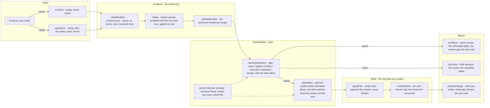

# construct sync

The flow below is rendered from [composition/sync.yaml](composition/sync.yaml). Edit the model, then
run `pnpm composition:render`; `pnpm composition:check` fails when the diagram and the model drift
apart.

<!-- composition:sync -->
Two entry points share one replay. `runSync(root, version)` in `src/commands/sync/index.ts` reads `construct.json`, replays today's template groups for the preset the manifest recorded, classifies every path into one of the seven classes, counts them, and hands the report to `printSync` or to `syncJson`; it writes nothing. `applySync(root, version)` replays the same evidence and writes only what `isWritable` allows — `add` and `update` where the strategy is `create` or `append-block`, never a `merge-json` target, a `conflict`, a `removed` or a `foreign` path — then records the owned view of each written path in the manifest's `sync` branch, leaving the branch `init` wrote untouched. A block target is spliced between the markers the present file already carries, so every byte outside them and every filled discovery body survives. The write effect an append-block target carries travels on the classification, so both the report and the apply output print it rather than restating it. The last line names the version that materialized the repository against the version reading it, and the exit code is set by the `add` and `update` counts alone — by what remained unwritten, under `--apply`.

<!-- /composition:sync -->

## What decides the exit code

Reporting: only `add` and `update` do. They are the paths this tool could write. `conflict`, `removed`
and `orphaned` are information — a conflict is a decision only an owner can make, a removed or
orphaned path is a fact about the tree, and none of them is work the tool can carry out. `keep` and
`foreign` are counted and never listed: `keep` is the quiet majority and `foreign` is not the
construct's to discuss.

Under `--apply` the same two classes decide it, by what is left of them: `0` when every path
classified `add` or `update` was written, `2` when one of them was refused because `isWritable` says
the construct cannot prove it owns the file — every `merge-json` target — and `1` when there is no
`construct.json` or a write failed. A refusal is not an error: it is the honest reading of what the
record proves, printed with the keys that differ so the owner can carry them across.

## What `--apply` writes, and what it never writes

It writes the paths where `isWritable` holds: `add` and `update`, and only where the strategy is
`create` or `append-block`. A `create` target is written as the templates produce it. An
`append-block` target that is absent is written whole; one that is present is spliced — the produced
text between the markers replaces the text between the markers the file already carries, every byte
outside them survives, and a filled `construct:discover` body is carried over into what is written.
The writer never routes through `appendBlock`: that path is `init`'s first contact with a file, and
its second-H1 demotion would make what is written differ from what was compared, so the next sync
would read `update` forever.

It never writes anything else. `keep` has nothing to write, `conflict` is a decision only an owner
can make, `removed` stays removed however loudly the templates produce it, `orphaned` has passed to
the owner and `foreign` was never ours. No `merge-json` target is written in this version at all,
including a `package.json` whose owned keys read as `update`: the record cannot say which keys were
the construct's, so the keys are reported and left to the owner. No file is ever deleted — `applyPlan`
creates and overwrites and has no delete — and no flag turns any of this off.

Each written path has the sha of its owned view recorded in the manifest's `sync` branch, with when
the run happened, the version that materialized the repository and the version that wrote. The branch
`init` wrote is not touched: decision 0006 froze it. The manifest is written once, after the files, so
a failed write leaves no record claiming the file exists; when nothing was written, `construct.json`
is not touched at all.

That frozen `init` branch is also why `doctor` still lists a file sync rewrote as modified: the
baseline `doctor` checks is the sha `init` recorded, and a rewritten block no longer hashes to it.
Sync records what it wrote in its own branch rather than correcting the baseline, because correcting
it would erase the evidence of what `init` actually did.
