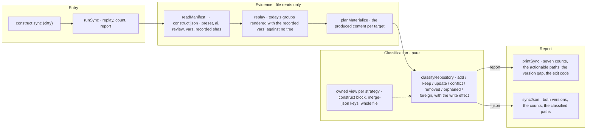

# construct sync

The flow below is rendered from [composition/sync.yaml](composition/sync.yaml). Edit the model, then
run `pnpm composition:render`; `pnpm composition:check` fails when the diagram and the model drift
apart.

<!-- composition:sync -->
`runSync(root, version)` in `src/commands/sync/index.ts` is the composition root: it reads `construct.json`, replays today's template groups for the preset the manifest recorded, classifies every path into one of the seven classes, counts them, and hands the report to `printSync` or to `syncJson`. This version reports and writes nothing — no file, no manifest. The write effect an append-block target carries travels on the classification, so the report prints it rather than restating it. The last line names the version that materialized the repository against the version reading it, and the exit code is set by the `add` and `update` counts alone.

<!-- /composition:sync -->

## What decides the exit code

Only `add` and `update` do: they are the paths this tool could write. `conflict`, `removed` and
`orphaned` are information — a conflict is a decision only an owner can make, a removed or orphaned
path is a fact about the tree, and none of them is work the tool can carry out. `keep` and `foreign`
are counted and never listed: `keep` is the quiet majority and `foreign` is not the construct's to
discuss.

## What this version does not do

It writes nothing — not a file, not the manifest it just read. Merge-json targets are reported by
their keys and are not written at all in this version, which is why `package.json` never appears
among the writable paths. Reporting and writing are separate changes on purpose: a person can look
at what would happen before anything happens.
