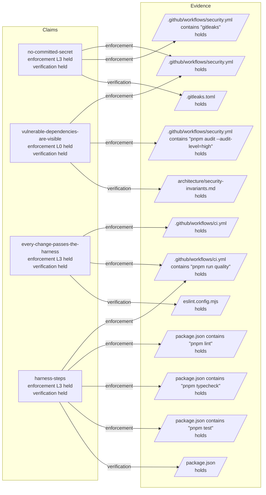

# Getting started

`mikoshi-construct` materializes a **construct** into a repository: the architecture policy, the API
contract, the quality harness and the instructions your coding agent reads before it touches
anything. It then stays around to check that what it wrote is still there, and to move it onto newer
templates when a release lands.

Nothing is installed globally unless you want it to be.

```bash
npx mikoshi-construct init
```

## Into an empty directory

```bash
mkdir my-service && cd my-service
npx mikoshi-construct init --yes --preset node-backend
pnpm install && pnpm run quality
```

The harness is green on the first run. That is the point of the preset shipping generated artifacts —
the OpenAPI types and the rendered composition document are already there, so the gate you are asked
to trust passes before you have written a line.

| Preset | What it is for |
|---|---|
| `node-backend` | A service with an HTTP contract: Express app, OpenAPI, contract tests |
| `node-frontend` | A frontend project: the same policy and harness without the API contract |
| `node-library` | A package with no application shell |
| `monorepo` | A pnpm workspace with a catalog, apps and packages |

`--ai claude | cursor | both` decides which agent instructions are written, `--review claude` adds
the label-triggered review workflow, and `--dry-run` prints the plan and writes nothing.

## Into a repository that already exists

This is the case the tool is built for, and the rules are strict:

- Your files are never overwritten. A file that exists is skipped and named in the report.
- `AGENTS.md`, `CLAUDE.md` and `.gitignore` are the exceptions, and only between the
  `construct:begin … construct:end` delimiters. Everything you wrote outside them survives, and a
  discovery block you already filled is carried across.
- `package.json` is merged. Your values win, and every conflict is printed for you to resolve.
- Sample code is written only into an empty directory. A repository with code gets policy and
  tooling, never examples.
- There is no `--force`, and adding one is not on the roadmap.

To see what the detector reads before anything is written, run
[`construct soulkill`](/cli#construct-soulkill) first. It prints the package manager, the layout, the
workspace packages and the files that already exist, and writes nothing.

```bash
cd an-existing-service
npx mikoshi-construct init --yes --preset node-backend
```

Expect the run to end with a warning listing the files it did not touch. That list is the honest
answer: the construct brought its policy, and wiring it to your existing configuration is a decision
only you can make. [`construct doctor`](/cli#construct-doctor) tells you which parts are wired and
which are not.

## What lands

| Path | What it is |
|---|---|
| `AGENTS.md` | The cross-tool entry point, with ten discovery blocks for the agent to fill |
| `CLAUDE.md` | A thin Claude Code entry that imports `AGENTS.md` |
| `architecture/principles.md` | Architecture, security and reasoning-budget rules |
| `architecture/composition/` | Composition models: one per flow, machine-readable, diagrams rendered from them |
| `architecture/decisions/` | Where decisions that shape what the project may claim are recorded |
| `.claude/` or `.cursor/` | Rules, agents, skills and the `/implement` ladder |
| `construct.json` | The manifest: preset, harness command, contract paths, a hash per file written |
| `construct.model.json` | What is claimed about the repository and how each claim is held — committed, and read by `doctor` |

## Then hand it to the agent

```bash
claude            # then /construct-discover
```

Discovery fills the ten blocks by reading your code — what the product does, the module map, the
commands, the composition roots, the dependency policy, the high-effort areas, the defects it will
not fix by accident, the open questions. Cursor users ask the agent to run the construct discovery;
it follows the same protocol.

## Then look at what it believes

`init` writes the files, `doctor` reports on them, and `construct graph` shows you the picture the
reports are read out of — so you can look at what the tool holds true about your repository instead of
reading `construct.model.json`.

```bash
construct graph
```

It draws every claim, every hypothesis discovery has written, and the evidence each one stands on. A
file that several entries stand on is drawn **once**, with an edge from each of them, which is the
thing a list of claims cannot show you. Here is a repository straight after `init`, before discovery
has added anything:



A repository with no `construct.model.json` draws nothing and says so, rather than showing an empty
diagram — absence is not the same as a model that claims nothing. **`init` is what creates the model**,
so that is the state to expect in a repository the construct has not been run in yet.

The diagram goes to standard output, so `construct graph > picture.mmd` keeps it; the
[CLI reference](/cli) has the rest.

From there the loop is [the development cycle](/guide/the-cycle).
