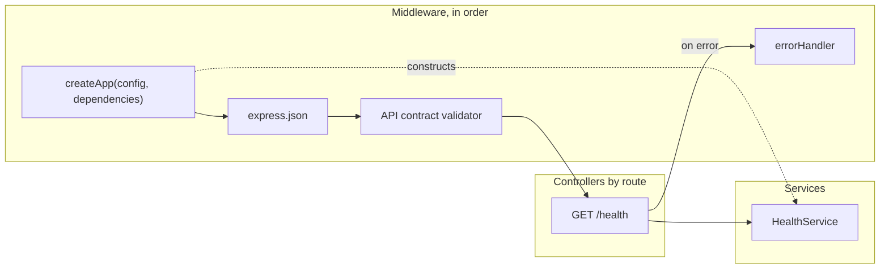

# HTTP API

The request path and the wiring below are rendered from
[composition/http.yaml](composition/http.yaml). Edit the model, then run `pnpm composition:render`;
`pnpm composition:check` fails when the diagram and the model drift apart.

<!-- composition:http -->
`createApp(config, dependencies)` is the composition root: middleware runs in the order shown, every service is constructed there and handed to a controller, and nothing else constructs a service. Dotted edges are wiring, solid edges are the request path.

<!-- /composition:http -->

## Conventions

File names carry the role: `*.controller.ts` (routing and HTTP), `*.service.ts` (business logic),
`*.middleware.ts` (Express middleware). One feature per directory. `src/config.ts` is the only reader
of `process.env`; `src/http/` is the only place that reads `req.body`, `req.query` or `req.params`
(both are lint rules). Expected failures throw `AppError(code, status, message)`; the global
`errorHandler` turns it into `{ error, message }`, and anything else becomes a 500 with a generic body.
