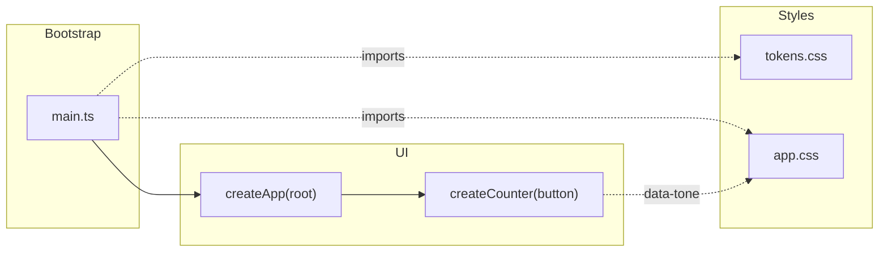

# Application

The bootstrap path and the wiring below are rendered from
[composition/app.yaml](composition/app.yaml). Edit the model, then run `pnpm composition:render`;
`pnpm composition:check` fails when the diagram and the model drift apart.

<!-- composition:app -->
`src/main.ts` is the composition root: it finds the mount point in `index.html`, loads the design tokens and the component styles, and hands the root element to `createApp`. State crosses into CSS as `data-*` attributes; nothing else writes styles from JavaScript.

<!-- /composition:app -->

## Conventions

`src/main.ts` is the only file that touches `document` at module scope; everything else receives its
root element. State that CSS must see is written as a `data-*` or ARIA attribute (a lint rule rejects
`classList` mutation and inline style writes in `src/`). Tokens live in
[src/styles/tokens.css](../src/styles/tokens.css); a raw colour, length or duration in a component is a
missing token. Layout reacts to its container, never to the viewport.
