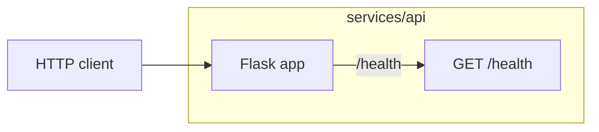

# Flask API service

The request flow of `services/api`. The diagram is rendered from
[composition/api.yaml](composition/api.yaml) by `pnpm composition:render`; edit the model, not the block.

<!-- composition:api -->
The Flask app in services/api answers GET /health; total() is defined beside it and not yet routed.

<!-- /composition:api -->
