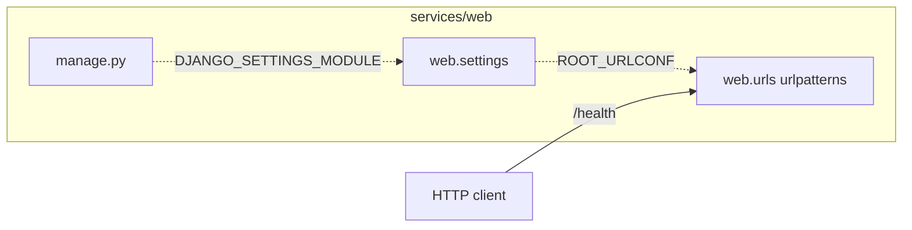

# Django web service

The request flow of `services/web`. The diagram is rendered from
[composition/web.yaml](composition/web.yaml) by `pnpm composition:render`; edit the model, not the block.

<!-- composition:web -->
manage.py loads web.settings, whose ROOT_URLCONF routes GET /health through web/urls.py.

<!-- /composition:web -->
